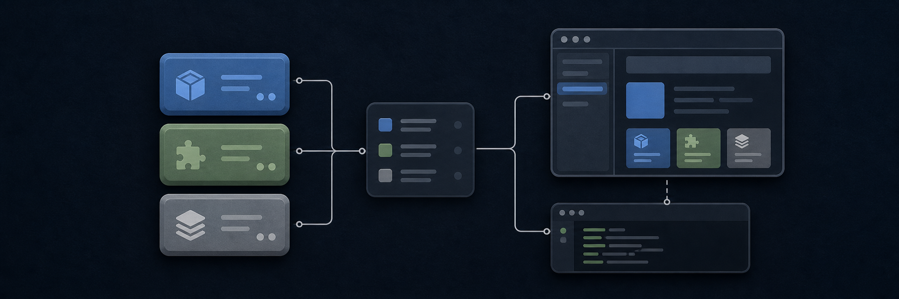

# ModularCore Hub

<p align="center">
  
</p>

ModularCore Hub es el punto de distribución de componentes reutilizables para proyectos web. El
catálogo publica los componentes y sus metadatos; puedes llevarlos a tu proyecto con el CLI o
pedírselos a un agente mediante el servidor MCP. El código resultante queda en tu repositorio y
puedes adaptarlo a tus necesidades.

> El portal de documentación oficial estará en
> [docs.modularcoreft.com](https://docs.modularcoreft.com). Mientras se publica, esta guía y el
> código del repositorio son la referencia disponible.

## Elige cómo usarlo

| Necesidad | Opción |
| --- | --- |
| Explorar, inicializar un proyecto e incorporar componentes desde la terminal | [CLI](#cli) |
| Pedir componentes desde Cursor, Claude Code, VS Code u otro cliente MCP | [MCP](#mcp) |
| Consultar la documentación oficial cuando esté disponible | [docs.modularcoreft.com](https://docs.modularcoreft.com) |

## CLI

El CLI público es [`@modularcore/cli@0.2.1`](https://www.npmjs.com/package/@modularcore/cli) y
expone el comando `modularcore`.

Requiere Node.js 18 o superior.

```bash
npm install --global @modularcore/cli@0.2.1
```

Desde la raíz de tu proyecto, inicialízalo:

```bash
modularcore init
```

El asistente crea `modularcore.json`, detecta o solicita el framework y pregunta las rutas de
destino. Cuando solicite la URL del registry, utiliza la correspondiente a tu despliegue de
ModularCore Hub.

Después puedes descubrir e incorporar componentes:

```bash
modularcore list
modularcore search modal
modularcore add auto-seo
```

`add` copia los archivos del componente al proyecto activo. Revisa siempre las dependencias y
variables de entorno que el comando muestre antes de confirmar. Consulta todas las opciones con
`modularcore --help` o la ayuda específica con `modularcore add --help`.

## MCP

El servidor [`@modularcore/mcp-server@0.3.1`](https://www.npmjs.com/package/@modularcore/mcp-server)
conecta un cliente compatible con MCP al registry mediante **stdio**. El cliente inicia el proceso
cuando lo necesita; no es necesario mantener un servicio MCP desplegado.

Configura un servidor stdio en tu cliente MCP. Este es el formato base; sustituye
`https://<tu-host-del-hub>/registry` por la URL HTTPS de tu despliegue:

```json
{
  "mcpServers": {
    "modularcore": {
      "type": "stdio",
      "command": "npx",
      "args": ["-y", "@modularcore/mcp-server@0.3.1"],
      "cwd": "/ruta/absoluta/a/tu-proyecto",
      "env": {
        "MODULARCORE_REGISTRY_URL": "https://<tu-host-del-hub>/registry"
      }
    }
  }
}
```

Configura `cwd` como la raíz del proyecto abierto cuando tu cliente admita esa propiedad. Si no la
admite, registra o inicia el servidor desde esa raíz. El MCP permite buscar y consultar
componentes y, cuando el cliente admite confirmación, guardar sus archivos dentro del proyecto
activo. No instala dependencias npm automáticamente: el agente o la persona que lo use debe
revisar e instalar las dependencias indicadas.

Las rutas exactas para Cursor, Claude Code, VS Code y otros clientes compatibles se publicarán en
[docs.modularcoreft.com](https://docs.modularcoreft.com).

## Ejemplo mínimo

Para incorporar un componente público y agnóstico de framework desde la terminal:

```bash
modularcore add auto-seo
```

El CLI descargará la definición desde el registry configurado, mostrará la dependencia
`zod@^4.4.3` y pedirá confirmación antes de copiar los archivos en las rutas elegidas durante
`modularcore init`. A partir de ahí, esos archivos pertenecen a tu proyecto: modifícalos,
revísalos y versiónalos como cualquier otro código de tu aplicación.

## Desarrollo del Hub

Este repositorio es un monorepo de Node.js gestionado con pnpm. Para trabajar en él:

```bash
corepack enable
pnpm install
pnpm build
pnpm typecheck
pnpm test
```

Para contribuir, consulta [CONTRIBUTING.md](./CONTRIBUTING.md).
